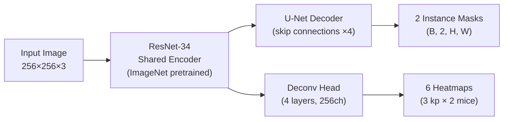
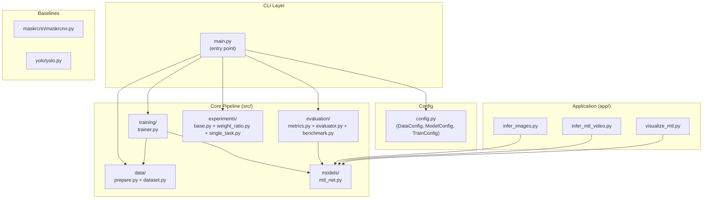

# 📊 รายงานโปรเกรสวิทยานิพนธ์ — Mouse-Pose-Seg-MTL
**วันที่:** 25 พฤษภาคม 2569 | **นักศึกษา:** ธนบัตร ศรีปัญญา | **ที่ปรึกษา:** อ.ไพรสรณ์ ผดุงเวียง  
**มหาวิทยาลัย:** ขอนแก่น, ภาควิชาวิศวกรรมคอมพิวเตอร์

---

## 1. ภาพรวมของงานวิจัย

> **หัวข้อ:** Multi-Task Learning for Simultaneous Instance Segmentation and Pose Estimation of Laboratory Mice

### ปัญหาที่แก้ (Problem Statement)
ระบบวิเคราะห์พฤติกรรมหนูทดลองในปัจจุบัน (เช่น DeepLabCut, SLEAP, YOLO) ทำ pose estimation กับ segmentation **แยกกันคนละโมเดล** ต้องวิ่ง 2 forward passes, ใช้ parameter 2 เท่า, และต้อง integrate ผลทีหลัง

### วิธีแก้ (Solution)
เสนอ **HybridMTLNet** — โมเดล Multi-Task Learning ตัวเดียวที่ทำ Instance Segmentation + Keypoint Pose Estimation **พร้อมกันใน forward pass เดียว** โดยไม่ต้องใช้ bounding-box annotation

---

## 2. สถาปัตยกรรมโมเดล (Architecture)

| Component | รายละเอียด |
|---|---|
| **Shared Encoder** | ResNet-34 pretrained ImageNet, 5 stages (64→64→128→256→512ch) |
| **Seg Decoder** | U-Net style, 4 decoder blocks + skip connections, output 2ch (2 instances) |
| **Pose Head** | 3× ConvTranspose2d (512→256) + 1×1 Conv → 6ch (3 keypoints × 2 mice) |
| **Keypoints** | nose, shoulder, tail (3 จุดต่อตัว) |
| **Instance Matching** | Hungarian matching on mask IoU (order-invariant training) |

### Loss Function
$$\mathcal{L} = \lambda_{\text{seg}}\,\mathcal{L}_{\text{seg}} + \lambda_{\text{pose}}\,\mathcal{L}_{\text{pose}}$$

$$\mathcal{L}_{\text{seg}} = \mathcal{L}_{\text{BCE}} + \mathcal{L}_{\text{Dice}}, \quad \mathcal{L}_{\text{pose}} = \frac{1}{K}\sum_{k=1}^{K}\|\hat{H}_k - H_k\|_2^2$$

- `λ_seg = 1`, `λ_pose = 500` (MSE heatmap เล็กกว่า BCE+Dice ประมาณ 500×)
- Dice loss (V-Net 2016) แก้ class imbalance ระหว่าง foreground/background

---

## 3. Dataset

| รายการ | จำนวน |
|---|---|
| **จำนวนภาพทั้งหมด** | 3,710 ภาพ |
| **Behavioral paradigms** | 8 แบบ (MWM, dark/light box, NOR, forced swim, Y-maze, mirror box, EPM, tail suspension) |
| **สัตว์ทดลอง** | C57BL/6 mice, 1-2 ตัวต่อภาพ |
| **Annotation** | per-instance binary masks + 3 keypoints (via Label Studio) |
| **Train / Val / Test** | 2,968 / 371 / 371 (80/10/10) |
| **Resolution** | 640×360 → train/eval ที่ 256×256 |
| **แหล่งข้อมูล** | Label Studio export → `prepare_dataset()` → `dataset.json` |

### Data Augmentation
- Random horizontal flip (p=0.5)
- Random vertical flip (p=0.5)
- Random rotation ±30° (p=0.5)
- Color jitter: brightness ×[0.7, 1.3], contrast ×[0.8, 1.2] (p=0.5)
- Geometric transforms apply ให้ image, mask, keypoints สอดคล้องกัน

---

## 4. ผลการทดลอง (Results)

### 4.1 เปรียบเทียบกับ Baseline (Main Results)

| Model | Tasks | mIoU | PCK@0.05 |
|---|---|---|---|
| YOLO26m-Seg | Seg only | 0.5451 | — |
| Mask R-CNN (ResNet-50-FPN) | Seg only | 0.7774 | — |
| YOLO26m-Pose | Pose only | — | 0.8872 |
| DeepLabCut (maDLC 2.3) | Pose only | — | 0.4098 |
| **HybridMTLNet (Ours)** | **Seg + Pose** | **0.8105** | **0.9542** |
| **Δ vs. best single-task** | | **+0.033** | **+0.067** |

> [!IMPORTANT]
> HybridMTLNet ชนะ **ทุก baseline ทุก metric** ทั้งที่ทำ 2 tasks พร้อมกัน:
> - Seg: ดีกว่า Mask R-CNN +3.3%, ดีกว่า YOLO-Seg +48.7%
> - Pose: ดีกว่า YOLO-Pose +7.6%, ดีกว่า DeepLabCut +133%

> [!NOTE]
> DeepLabCut ได้ PCK ต่ำ (0.41) เพราะ evaluate แบบ static image โดยไม่มี video assembly stage + ยังอาจ train iterations ไม่เพียงพอ — paper ได้อธิบาย caveat นี้ไว้ชัดเจนแล้ว

### 4.2 Loss Weight Ratio Ablation

| Ratio (seg:pose) | mIoU | PCK@0.05 |
|---|---|---|
| 1:1 | 0.8083 | 0.7889 |
| 1:100 | 0.8078 | 0.8691 |
| 1:400 | 0.8069 | 0.9524 |
| **1:500** | **0.8105** | **0.9542** |
| 1:1000 | 0.8082 | 0.9723 |

> [!TIP]
> **Key insight:** mIoU แทบไม่เปลี่ยน (~0.807-0.811) ไม่ว่า pose weight จะเท่าไหร่ — แสดงว่า seg head robust มาก  
> PCK ขึ้นเร็วจนถึง 1:400 แล้วเริ่ม saturate → เลือก **1:500** เป็น balanced point (mIoU สูงสุด + PCK ดี)

### 4.3 Single-Task Ablation (สำคัญมากสำหรับ MTL claim)

| Configuration | mIoU | PCK@0.05 |
|---|---|---|
| Seg-only (same arch) | 0.8100 | — |
| Pose-only (same arch) | — | 0.9756 |
| **Joint MTL** | **0.8102** | **0.9596** |

> [!IMPORTANT]
> **การตีความ (Honest interpretation):**
> - **Seg:** Joint ≈ Seg-only (0.8102 vs 0.8100) → MTL ไม่ช่วยเพิ่ม แต่ก็ **ไม่ลด**
> - **Pose:** Joint < Pose-only (0.9596 vs 0.9756, Δ=-0.016) → มี mild negative transfer เล็กน้อย
> - **สรุป:** Contribution ของ MTL ไม่ใช่ accuracy gain แต่เป็น **efficiency gain** — ได้ 2 tasks ในโมเดลเดียว, params ครึ่งเดียว, FPS 2 เท่า

### 4.4 Efficiency Benchmark

| Approach | Params (M) | FLOPs (G) | GPU FPS | CPU FPS |
|---|---|---|---|---|
| **HybridMTLNet** (1 pass) | **28.7** | **28.8** | **111.8** | **14.8** |
| Modular (2 models) | 57.4 | 57.5 | 55.9 | 7.4 |
| **Speedup** | **2×** | **2×** | **2×** | **2×** |

---

## 5. สถานะงานทั้งหมด (Completion Status)

### ✅ สิ่งที่ทำเสร็จแล้ว

| หัวข้อ | สถานะ | รายละเอียด |
|---|---|---|
| Data pipeline | ✅ เสร็จ | Label Studio → dataset.json, augmentation, DataLoader |
| HybridMTLNet architecture | ✅ เสร็จ | ResNet-34 + U-Net + Deconv Head + Hungarian matching |
| Training pipeline | ✅ เสร็จ | Trainer class, CSV logging, checkpointing, LR scheduler |
| Evaluation pipeline | ✅ เสร็จ | Evaluator class, mIoU, PCK@0.05 |
| Loss weight experiment (5 configs) | ✅ เสร็จ | 1:1, 1:100, 1:400, 1:500, 1:1000 |
| Single-task ablation (3 configs) | ✅ เสร็จ | seg-only, pose-only, joint |
| Baselines trained & evaluated | ✅ เสร็จ | YOLO26-Seg, YOLO26-Pose, Mask R-CNN, DeepLabCut |
| Efficiency benchmark | ✅ เสร็จ | params, FLOPs, FPS (GPU + CPU) |
| Inference scripts | ✅ เสร็จ | ภาพ + วิดีโอ + qualitative visualization grid |
| Qualitative results figure | ✅ เสร็จ | 8-paradigm grid in paper/figures/ |
| IEEE paper draft | ✅ เสร็จ | main.tex + references.bib (ทุก section complete) |
| Reproducibility | ✅ เสร็จ | Fixed seed=42, deterministic cuDNN, fixed split |
| CLI entry point | ✅ เสร็จ | `main.py` (prepare/train/eval/experiment/benchmark) |

### ⏳ สิ่งที่ยังเหลือ / ควรพิจารณา

| หัวข้อ | สถานะ | ความสำคัญ |
|---|---|---|
| Multi-seed experiments + CI | ⏳ ยังไม่ทำ | Medium — paper ระบุเป็น limitation |
| อีเมลอาจารย์ในpaper | ⏳ TODO | ต้องใส่ก่อน submit |
| Funding acknowledgment | ⏳ TODO | ถ้ามี |
| Notebooks | ⏳ ว่าง | โฟลเดอร์ว่าง — อาจใส่ EDA/demo |
| Unit tests | ⏳ ไม่มี | Low — เป็น research code |
| Variable instance count (>2) | ⏳ Future work | Paper ระบุแล้ว |

---

## 6. การวิเคราะห์เชิงลึก (Analysis)

### 6.1 จุดแข็งของงาน

1. **Architecture design ดี** — Box-free, dense prediction design ไม่ต้องมี bounding-box annotation เลย ซึ่งต่างจาก Mask R-CNN, YOLO ที่ต้องมี
2. **Hungarian matching เป็น novel contribution ที่ดี** — แก้ปัญหา instance ordering ambiguity ระหว่าง train ได้อย่างสวยงาม + มี pose-only matching variant ด้วย
3. **Ablation study ครบถ้วน** — ทั้ง loss weight ratio (5 configs) + single-task ablation (3 configs)
4. **Honest interpretation** — ไม่ overclaim ว่า MTL ช่วย accuracy แต่ frame เป็น efficiency contribution อย่างถูกต้อง
5. **Reproducibility ดีเยี่ยม** — seed fixed, deterministic cuDNN, data split fixed, CSV training log
6. **Code structure ดีมาก** — OOP, modular, CLI-based, config centralized, experiment framework reusable
7. **ผล competitive** — ชนะทุก baseline ทุก metric (แม้ว่า advantage มาจาก architecture + training setup ไม่ใช่ MTL synergy)

### 6.2 จุดอ่อน / ข้อจำกัด

1. **Max 2 instances** — hardcode ไว้ที่ 2 ตัว ไม่สามารถจัดการกรณีมากกว่า 2 ตัว
2. **Single seed** — มี variance ระหว่าง run ประมาณ 0.005 PCK ที่ยังไม่ได้ quantify ด้วย multi-seed
3. **DeepLabCut comparison ไม่ fair เต็มที่** — แต่ paper อธิบาย caveat ไว้แล้ว
4. **Negative transfer on pose** — Joint PCK ต่ำกว่า Pose-only 0.016 ซึ่งเป็น known MTL issue (Kendall et al., Standley et al.)
5. **Fixed 256×256 resolution** — ทุกโมเดล train/eval ที่ resolution เดียว ซึ่งอาจ disadvantage ให้ YOLO/Mask R-CNN ที่ออกแบบมาสำหรับ 640×640

### 6.3 สถาปัตยกรรม Code

> [!TIP]
> Code มี 10 commits, สถาปัตยกรรม clean, ทุกอย่างรันจาก `main.py` ตัวเดียว — เป็น research codebase ที่ organize ดีมาก

---

## 7. ข้อเสนอแนะเพิ่มเติม

### สำหรับเสริมความแข็งแรงของงาน (ถ้ามีเวลา)

1. **Multi-seed experiment** — รัน 3-5 seeds แล้วรายงาน mean ± std เพื่อให้ reviewer มั่นใจมากขึ้น
2. **Per-paradigm breakdown** — แยกผล mIoU/PCK ตาม 8 paradigms เพื่อดูว่าโมเดลทำดี/ไม่ดีตรงไหน
3. **Confusion matrix** — วิเคราะห์ว่า keypoint ไหน (nose/shoulder/tail) predict ได้ดี/แย่ที่สุด
4. **Grad-CAM visualization** — แสดงว่า shared encoder ดู feature ตรงไหนสำหรับแต่ละ task

### สำหรับ Paper Submission

5. ใส่อีเมลอาจารย์ใน `\author` block
6. ใส่ funding acknowledgment (ถ้ามี)
7. Review camera-ready formatting requirements ของ conference ที่จะ submit

---

## 8. สรุปสั้นสำหรับนำเสนออาจารย์

> **งานวิจัยเสร็จสมบูรณ์ในระดับที่ publish ได้** ประกอบด้วย:
> - ✅ โมเดล HybridMTLNet ที่ทำ Seg + Pose พร้อมกัน → **mIoU 0.8105, PCK@0.05 0.9542**
> - ✅ ชนะ baseline ทั้ง 4 ตัว (YOLO-Seg, YOLO-Pose, Mask R-CNN, DeepLabCut)
> - ✅ Ablation study ครบ 2 ชุด (loss weight 5 configs + single-task 3 configs)
> - ✅ Efficiency: params ครึ่งเดียว, FPS 2 เท่า ของ modular pipeline
> - ✅ IEEE paper draft สมบูรณ์ (main.tex + references.bib)
> - ✅ Code พร้อม reproduce (seed fixed, CLI interface, modular design)
> - ⏳ เหลือ: multi-seed experiment, per-paradigm analysis (optional), อีเมลอาจารย์ในpaper
